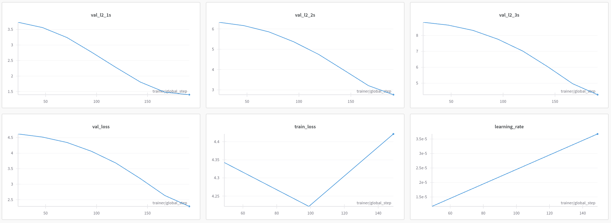
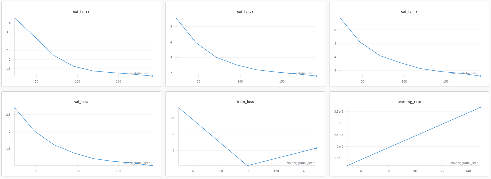
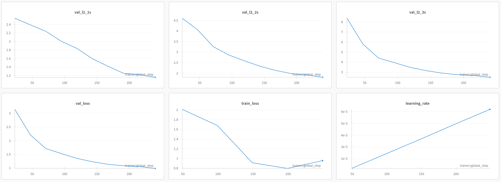
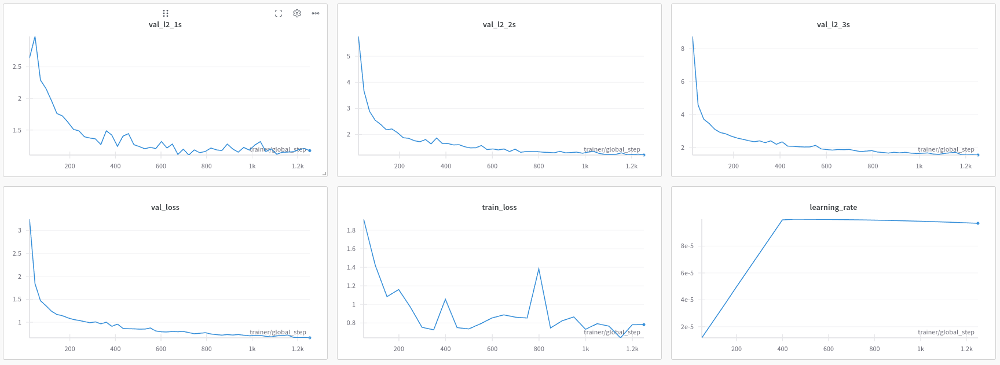
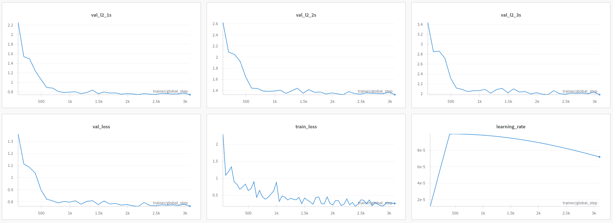
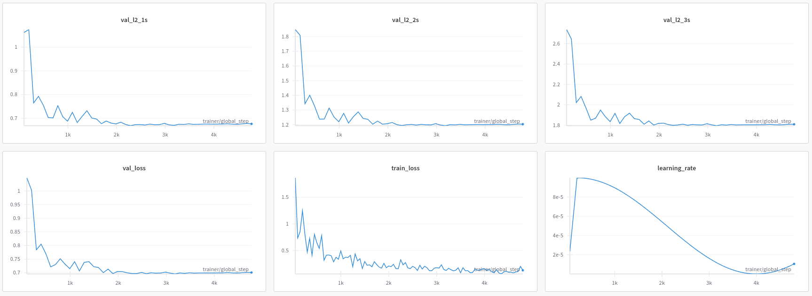

# D3Nav Experiemtns

We run the following exeriments:

| Model | L2 1s | L2 2s | L2 3s | Train Loss | Val Loss |
|-------|--------|--------|--------|------------|-----------|
| ResNet (Pure) | 1.39 | 3.0 | 4.5 | 4.4 | 2.5 |
| ResNet-Traj (Frozen) | 1.13 | 2.0 | 2.8 | 1.0 | 1.0 |
| ResNet-Traj-ft (Unfrozen) | 1.08 | 2.0 | 3.0 | 1.0 | 1.1 |
| D3Nav-3L | 1.14 | 1.4 | 2.0 | 0.8 | 0.8 |
| D3Nav-3L-ft | 0.76 | 1.4 | 2.0 | 0.3 | 0.8 |
| D3Nav-3L-ft-CA | 0.66 | 1.2 | 1.8 | 0.2 | 0.7 |

Key observations:
1. D3Nav outperforms the ResNet baseline
2. Adding the trajectory decoder (ResNet-Traj) significantly improves performance
3. The D3Nav variants show progressive improvements

## Baseline ResNet-34

ResNet: Pure ResNet regressing 6x2 trajectory

ResNet-Traj: ResNet with frozen Trajectory Decoder

ResNet-Traj-ft: ResNet with unfrozen Trajectory Decoder fine tuned

# D3Nav

D3Nav-3L: Unfrozen 3 Layers, frozen Trajectory Decoder

D3Nav-3L-ft: Unfrozen 3 Layers, unfrozen Trajectory Decoder

D3Nav-3L-ft-CA: Unfrozen 3 Layers, unfrozen Trajectory Decoder, chunked attention

